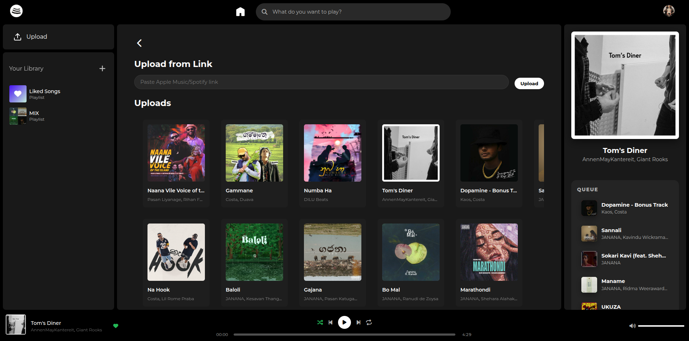

# Openfy

A self-hosted music streaming platform.

## Quick Start

```bash
docker compose up --build
```

Visit http://localhost:8000

## Features

- Web-based music player and library
- Upload local files or download from Spotify/Apple Music
- Multi-user support with playlists
- Admin interface for user and track management
- Docker deployment

## Screenshots

### Home Page


### Upload Page


### Artist Page


### Playlist Page


## Configuration

Create `server/.env`:

```env
OPENFY_ADMIN_USERNAME=admin
OPENFY_ADMIN_HASH=your_secure_hash
```

## Tech Stack

- **Frontend**: HTML, CSS, JavaScript
- **Backend**: FastAPI (Python)
- **Database**: SQLite

## License

MIT