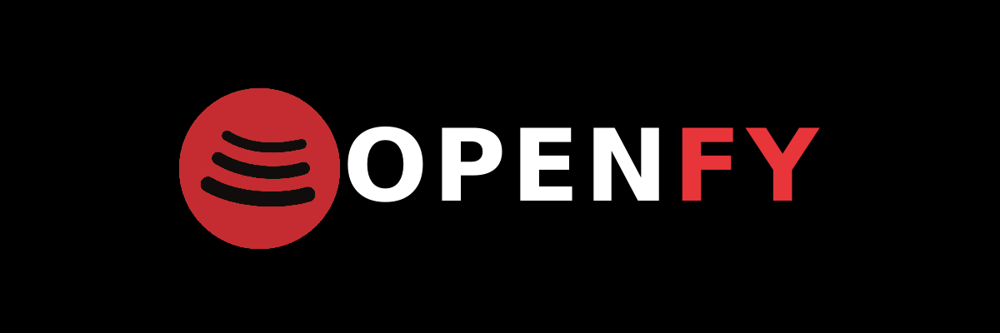

# Openfy

Your music. Your rules. No subscriptions. No surveillance.

## Why Openfy?

We built this because we're tired of renting music from big corporations. You pay monthly fees, they track your listening, and you don't own anything. Artists get pennies while streaming companies profit.

Openfy changes that:

- You own your music files
- No tracking, no ads, no monthly fees
- Your library stays private and under your control
- Support artists directly by buying their work

This is music as it should be.

## Features

- ✨ **Modern Web Interface**: Clean, Spotify-like player with smooth animations
- 📀 **Music Management**: Upload local files or download from Spotify/Apple Music links
- 🎵 **Smart Metadata**: Automatic artist, album, and artwork extraction
- 🎧 **High-Quality Streaming**: HTTP Range support for efficient audio streaming
- 📊 **Play Statistics**: Track play counts and most-played songs
- 🎼 **Playlists**: Create custom playlists and manage liked songs
- 👥 **Multi-User Support**: Separate libraries with individual auth hashes
- 🎨 **Dynamic Artwork**: Fallback canvas generation when artwork is missing
- ⌨️ **Keyboard Controls**: Space bar for play/pause, arrow keys for navigation
- 📱 **Responsive Design**: Works on desktop and mobile devices
- 🐳 **Docker Ready**: Single-command deployment
- 🔧 **Admin Interface**: User and track management for administrators

## Tech Stack

- **Frontend**: Vanilla HTML, CSS, JavaScript (no frameworks)
- **Backend**: FastAPI (Python) with SQLAlchemy ORM
- **Database**: SQLite (portable and serverless)
- **Audio Processing**: Mutagen for metadata extraction
- **Download Integration**: SpotiFLAC module for Spotify/Apple Music downloads

## Getting Started

### Quick Start with Docker

1. Clone the repository:
```bash
git clone https://github.com/yourusername/Openfy.git
cd Openfy
```

2. Run with Docker Compose:
```bash
docker compose up --build
```

3. Open your browser to http://localhost:8000

### Manual Development

1. Install server dependencies:
```bash
cd server
pip install -r requirements.txt
```

2. Start the development server:
```bash
uvicorn app.main:app --reload
```

3. Open http://localhost:8000 in your browser

## Configuration

### Environment Variables

Create a `.env` file in the `server` directory:

```env
OPENFY_ALLOWED_ORIGINS=*
OPENFY_ADMIN_USERNAME=admin
OPENFY_ADMIN_HASH=your_hash_here
OPENFY_API_BASE_URL=
```

### Data Persistence

The Docker setup automatically creates a volume at `openfy_data` for:
- SQLite database
- Uploaded music files
- Downloaded tracks
- Album artwork

## Usage Guide

### First-Time Setup

1. **Sign Up**: Create an account through the web interface
2. **Save Auth Hash**: Your auth hash is stored in localStorage
3. **Upload Music**: 
   - Use the Upload tab for local files
   - Paste Spotify/Apple Music links for automatic downloads
4. **Explore**: Browse your library, create playlists, and enjoy your music

### Key Features

- **Home Page**: Recently added tracks and quick access
- **Library**: Search and filter all your music
- **Uploads**: Your personally uploaded tracks
- **Playlists**: Create and manage custom collections
- **Player**: Full-featured audio player with progress bar
- **Admin**: User and track management (admin only)

### Keyboard Shortcuts

- `Space`: Play/Pause
- `←` / `→`: Previous/Next track
- `↑` / `↓`: Volume control

## API Reference

### Core Endpoints

| Endpoint | Method | Description |
|----------|--------|-------------|
| `/health` | GET | Server health check |
| `/tracks` | GET | List all tracks (with pagination) |
| `/tracks/{id}/stream` | GET | Stream audio with Range support |
| `/tracks/upload` | POST | Upload local audio file |
| `/tracks/most-played` | GET | Get most played tracks |
| `/search?q=` | GET | Search library |
| `/playlists` | GET/POST | List/create playlists |
| `/auth/signup` | POST | Create new account |
| `/auth/signin` | POST | Login with auth hash |

### Admin Endpoints

| Endpoint | Method | Description |
|----------|--------|-------------|
| `/admin/users` | GET/POST | Manage users |
| `/admin/tracks` | GET/DELETE | Manage tracks |

Full API documentation: [API.md](./API.md)

## Project Structure

```
Openfy/
├── client/                 # Frontend assets
│   ├── index.html         # Main application
│   ├── styles.css         # Application styles
│   ├── script.js          # Client-side logic
│   └── images/            # Static assets
├── server/                # Backend application
│   ├── app/               # Application code
│   │   ├── main.py       # FastAPI app & routes
│   │   ├── models.py     # SQLAlchemy models
│   │   ├── schemas.py    # Pydantic schemas
│   │   ├── services/     # Business logic
│   │   └── db.py         # Database connection
│   ├── requirements.txt  # Python dependencies
│   └── Dockerfile        # Server container
├── data/                 # Persistent storage
│   ├── music/           # Audio files
│   └── openfy.db        # SQLite database
└── docker-compose.yml   # Container orchestration
```

## Contributing

We welcome contributions! Please feel free to submit issues and pull requests.

## License

MIT License. See [LICENSE](./LICENSE) for details.

---

Built by music lovers, for music lovers. 🎵

Support the project by starring it on GitHub! ⭐
