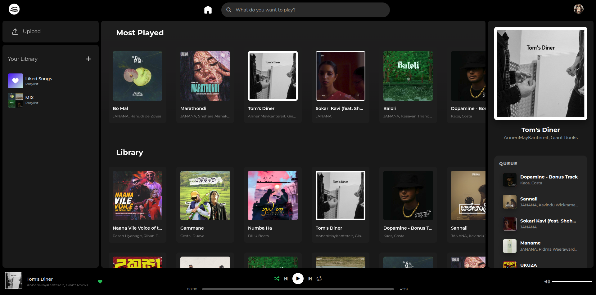
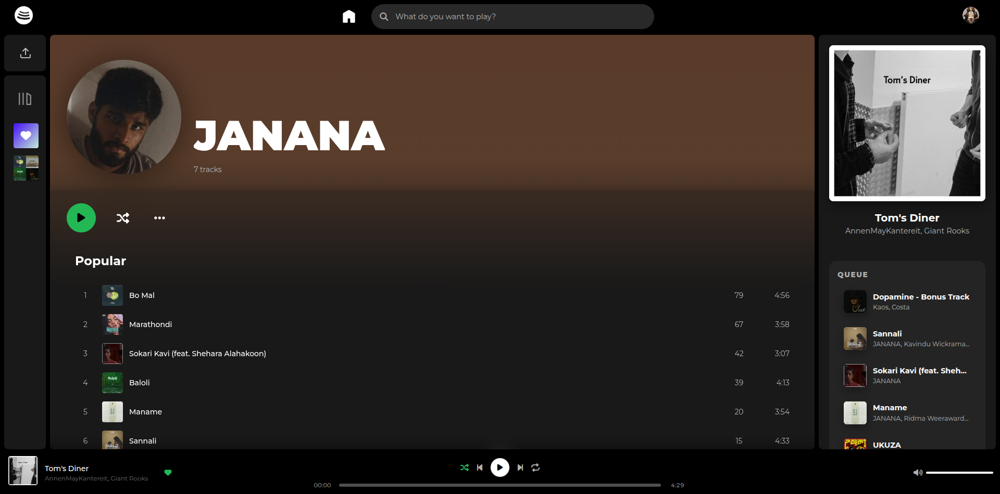
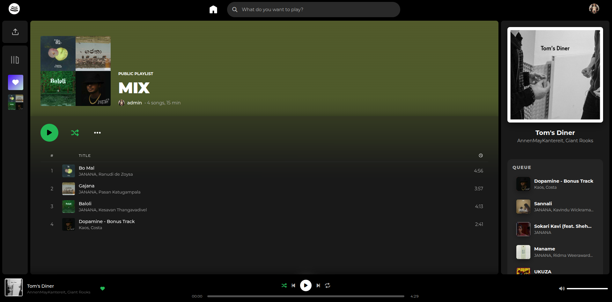

# Openfy

A self-hosted music streaming platform.

## Prerequisites
- Docker and Docker Compose
- For manual setup: Python 3.12+

## Quick Start

```bash
git clone https://github.com/NethminaYasas/Openfy.git
cd Openfy
cp .env.example .env   # fill in your values
docker compose up --build -d
```

Visit http://localhost:8000

## Manual Setup

```bash
git clone https://github.com/NethminaYasas/Openfy.git
cd Openfy/server
pip install -r requirements.txt
uvicorn app.main:app --reload
```

## Features

- **Web-based music player** - Stream your music library from any browser
- **Desktop & Mobile UI** - Dedicated mobile frontend served automatically for mobile devices
- **Upload music** - Upload local audio files (mp3, flac, wav, m4a, ogg, opus)
- **Spotify/Apple Music downloads** - Download tracks from streaming services via SpotiFLAC
- **Spotify playlist import** - Import entire Spotify playlists and albums with automatic deduplication
- **Multi-user support** - Each user gets their own library, playlists, and queue
- **Liked Songs** - Universal "Liked Songs" playlist per user
- **Playlist management** - Create, rename, reorder, pin, and share public playlists
- **Follow playlists & albums** - Follow other users' public playlists and albums
- **Album management** - Auto-organized album views with artwork extraction
- **Artist pages** - Dedicated artist pages with all tracks and albums
- **Search** - Search by track title, artist name, or album title
- **Spotify search** - Search Spotify directly from the UI
- **Queue system** - Persistent per-user queue with shuffle and repeat modes
- **Player state persistence** - Shuffle, repeat, and volume settings saved per user
- **User avatars** - Upload profile pictures
- **Audio streaming** - HTTP range-request support for seeking and partial content
- **Admin dashboard** - User management, track management, system settings, and server stats
- **Rate limiting** - Auth endpoints protected against brute force
- **Stream tokens** - Time-limited tokens for secure audio streaming
- **Docker deployment** - Containerized setup with automatic database initialization

## Screenshots

### Home Page


### Upload Page


### Artist Page


### Playlist Page


> See the `docs/screenshots/` directory for more screenshots.

## Configuration

Copy `.env.example` to `.env` and fill in your values before starting.

Available environment variables (all prefixed with `OPENFY_`):

| Variable | Default | Description |
|----------|---------|-------------|
| `ENV` | `dev` | Environment mode |
| `DATABASE_URL` | `sqlite:///./data/openfy.db` | Database connection string |
| `DATA_DIR` | `./data` | Data directory path |
| `MUSIC_DIR` | `./data/music` | Music library path |
| `DOWNLOADS_DIR` | `./data/downloads` | Downloads directory |
| `ARTWORK_DIR` | `./data/artwork` | Album art cache directory |
| `ALLOWED_ORIGINS` | `http://localhost` | CORS allowed origins |
| `ADMIN_USERNAME` | `` | Admin username (auto-created on startup) |
| `ADMIN_HASH` | `` | Admin auth hash |
| `MAX_UPLOAD_SIZE_MB` | `200` | Maximum upload file size in MB |

## Generating an Admin Hash

```bash
python scripts/generate_hash.py yourpassword
```

Copy the output hash into your `.env` as `OPENFY_ADMIN_HASH`.

The `scripts/` directory contains developer/admin utilities.

## Architecture

- **Frontend**: Vanilla JS with ES modules in `client/modules/` - no Node.js/npm required
- **Backend**: FastAPI (Python) with SQLAlchemy ORM
- **Database**: SQLite (auto-initialized on first run)
- **Audio streaming**: HTTP range requests with optional time-limited stream tokens
- **SPA routing**: All non-API routes serve `index.html` for client-side routing
- **Mobile**: Separate mobile UI auto-detected via User-Agent

## Tech Stack

- **Frontend**: HTML5, CSS3, Vanilla JavaScript (ES Modules)
- **Backend**: FastAPI (Python 3.12+)
- **Database**: SQLite via SQLAlchemy
- **Auth**: X-Auth-Hash header (token-based, no Bearer/JWT)
- **Containerization**: Docker with multi-stage builds

## License

GNU General Public License v3.0
